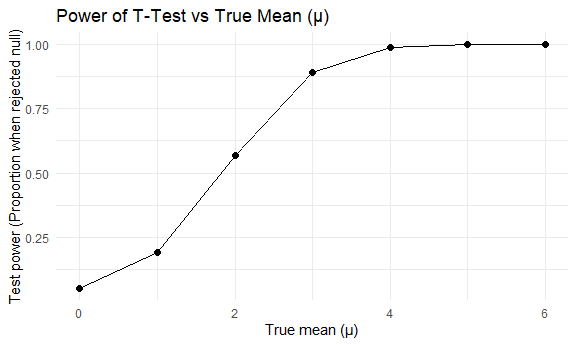
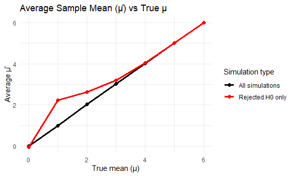
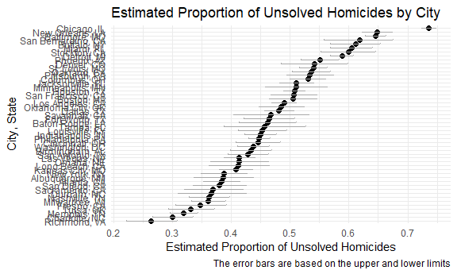

p8105_hw5_kw3180
================
Kino Watanabe
2025-11-14

# Load library and set theme

``` r
library(tidyverse)
```

    ## ── Attaching core tidyverse packages ──────────────────────── tidyverse 2.0.0 ──
    ## ✔ dplyr     1.1.4     ✔ readr     2.1.5
    ## ✔ forcats   1.0.1     ✔ stringr   1.6.0
    ## ✔ ggplot2   4.0.0     ✔ tibble    3.3.0
    ## ✔ lubridate 1.9.4     ✔ tidyr     1.3.1
    ## ✔ purrr     1.2.0     
    ## ── Conflicts ────────────────────────────────────────── tidyverse_conflicts() ──
    ## ✖ dplyr::filter() masks stats::filter()
    ## ✖ dplyr::lag()    masks stats::lag()
    ## ℹ Use the conflicted package (<http://conflicted.r-lib.org/>) to force all conflicts to become errors

``` r
library(broom)
library(ggplot2)
library(forcats)

knitr::opts_chunk$set(
  fig.width = 6,
  fig.asp = .6,
  out.width = "90%"
)

theme_set(theme_minimal() + theme(legend.position = "bottom"))

options(
  ggplot2.continuous.colour = "viridis",
  ggplot2.continuous.fill = "viridis"
)

scale_colour_discrete = scale_colour_viridis_d
scale_fill_discrete = scale_fill_viridis_d
```

# Problem 2

- `n_subj` is \# of subjects
- `mu` is the true mean
- `sigma` is the true sd

Generate 5000 datasets from the model x ~ Normal \[ mu, sigma \] for mu
= {0:6}

``` r
sim_mean_pval = function(mu, n_subj = 30, sigma = 5) {
  
  sim_data = tibble(
    x = rnorm(n_subj, mean = mu, sd = sigma)) |> 
     summarize(
      mu_hat = mean(x),
      p_value = t.test(x, mu = 0) |> tidy() |> pull(p.value),
      reject = p_value < 0.05
    )
}

sim_results_df = 
  expand_grid(
    mu = 0:6,
    iter = 1:5000
  ) |> 
  mutate(
    estimate_df = map(mu, ~ sim_mean_pval(.x, n_subj = 30, sigma = 5))
  ) |> 
  unnest(estimate_df)
```

sim_results \<- map_dfr(1:5000, ~ sim_mean_pval(n_subj = 30, mu = 0,
sigma = 5))

### Plot power vs true μ

``` r
power_df <- sim_results_df |>
  group_by(mu) |>
  summarize(power = mean(reject), .groups = "drop")

power_df |>
  ggplot(aes(x = mu, y = power)) +
  geom_line() +
  geom_point(size = 2) +
  labs(
    title = "Power of T-Test vs True Mean (μ)",
    x = "True mean (μ)",
    y = "Test power (Proportion when rejected null)"
  ) +
    theme(legend.position = "bottom")
```



- Power is the probability of rejecting the null when the alternative
  hypothesis is true. As the true mean (mu) increases, the effect size
  increases, and the power increases (proportional association). It is
  easier to detect larger effect sizes, so the power is greater. When
  the true mean reaches around 4, the power plateaus.

### Plot mu-hat vs mu and mu-hat in samples for which the null was rejected vs mu

- `mu` is the true mean
- `mu_hat` is the estimated mean

``` r
estimates_df <- sim_results_df |>
  group_by(mu) |>
  summarize(
    mean_mu_hat = mean(mu_hat),               
    mean_mu_hat_reject = mean(mu_hat[reject]),
    .groups = "drop"
  )
```

``` r
mu_plot <-
  ggplot(estimates_df, aes(x = mu)) +
    geom_line(aes(y = mean_mu_hat, color = "All simulations")) +
    geom_point(aes(y = mean_mu_hat, color = "All simulations"), size = 2) +
    geom_line(aes(y = mean_mu_hat_reject, color = "Rejected H0 only")) +
    geom_point(aes(y = mean_mu_hat_reject, color = "Rejected H0 only"), size = 2) +
    labs(
      title = "Average Estimated Mean (μ-hat) vs True μ",
      x = "True mean (μ)",
      y = "Average Estimated μ-hat",
      color = "Simulation type"
    ) +
    theme(legend.position = "bottom")

mu_plot
```



- The sample average of `mu`across tests for which the null is rejected
  **isn’t** approximately equal to the true value of `mu`. The purple
  “all simulations” line is the average estimated mean across all
  simulations, which is closer to the true mean `mu`. This makes sense,
  since it takes into account of simulations that rejected and failed
  the rejected the null. The effect size is unbiased compared to the
  underlying population mean. The yellow line with the average estimated
  mean for rejected nulls is overestimated from the true mean,
  particularly when `mu` is small, as the means are among simulations
  with statistically significant differences. For small `mu`,
  significant differences between true and estimated mean can occur by
  chance, so the mean estimate among rejected nulls is inflated.

# Problem 3

``` r
raw_homicide_df =
  read_csv("data-homicides-master/homicide-data.csv",
           na = c("NA", ".","")
  )
```

    ## Rows: 52179 Columns: 12
    ## ── Column specification ────────────────────────────────────────────────────────
    ## Delimiter: ","
    ## chr (9): uid, victim_last, victim_first, victim_race, victim_age, victim_sex...
    ## dbl (3): reported_date, lat, lon
    ## 
    ## ℹ Use `spec()` to retrieve the full column specification for this data.
    ## ℹ Specify the column types or set `show_col_types = FALSE` to quiet this message.

- **Describe the raw data**: There are 52179 observations and 12
  variables. There are important variables about victim personal
  information (`victim_last`, `victim_first`, `victim_age`,
  `victim_sex`) and incident location/specifics (`city`, `state`, `lat`,
  `lon`, `reported_date`).

``` r
homicide_df <- raw_homicide_df |>   
  janitor::clean_names() |> 
  mutate(
   state = case_match(state,
             "wI" ~ "WI",
             .default = state),
   city_state = str_c(city, ", ", state)
  ) |> 
  filter(city_state != "Tulsa, AL")

unsolved_table <- homicide_df |> 
  group_by(city_state) |> 
  summarize(
    total_homicides = n(),
    unsolved_homicides = sum(disposition %in% 
                               c("Closed without arrest", "Open/No arrest"), 
                             na.rm = TRUE), .groups = "drop"
  ) 

unsolved_table |> 
  knitr::kable()
```

| city_state         | total_homicides | unsolved_homicides |
|:-------------------|----------------:|-------------------:|
| Albuquerque, NM    |             378 |                146 |
| Atlanta, GA        |             973 |                373 |
| Baltimore, MD      |            2827 |               1825 |
| Baton Rouge, LA    |             424 |                196 |
| Birmingham, AL     |             800 |                347 |
| Boston, MA         |             614 |                310 |
| Buffalo, NY        |             521 |                319 |
| Charlotte, NC      |             687 |                206 |
| Chicago, IL        |            5535 |               4073 |
| Cincinnati, OH     |             694 |                309 |
| Columbus, OH       |            1084 |                575 |
| Dallas, TX         |            1567 |                754 |
| Denver, CO         |             312 |                169 |
| Detroit, MI        |            2519 |               1482 |
| Durham, NC         |             276 |                101 |
| Fort Worth, TX     |             549 |                255 |
| Fresno, CA         |             487 |                169 |
| Houston, TX        |            2942 |               1493 |
| Indianapolis, IN   |            1322 |                594 |
| Jacksonville, FL   |            1168 |                597 |
| Kansas City, MO    |            1190 |                486 |
| Las Vegas, NV      |            1381 |                572 |
| Long Beach, CA     |             378 |                156 |
| Los Angeles, CA    |            2257 |               1106 |
| Louisville, KY     |             576 |                261 |
| Memphis, TN        |            1514 |                483 |
| Miami, FL          |             744 |                450 |
| Milwaukee, WI      |            1115 |                403 |
| Minneapolis, MN    |             366 |                187 |
| Nashville, TN      |             767 |                278 |
| New Orleans, LA    |            1434 |                930 |
| New York, NY       |             627 |                243 |
| Oakland, CA        |             947 |                508 |
| Oklahoma City, OK  |             672 |                326 |
| Omaha, NE          |             409 |                169 |
| Philadelphia, PA   |            3037 |               1360 |
| Phoenix, AZ        |             914 |                504 |
| Pittsburgh, PA     |             631 |                337 |
| Richmond, VA       |             429 |                113 |
| Sacramento, CA     |             376 |                139 |
| San Antonio, TX    |             833 |                357 |
| San Bernardino, CA |             275 |                170 |
| San Diego, CA      |             461 |                175 |
| San Francisco, CA  |             663 |                336 |
| Savannah, GA       |             246 |                115 |
| St. Louis, MO      |            1677 |                905 |
| Stockton, CA       |             444 |                266 |
| Tampa, FL          |             208 |                 95 |
| Tulsa, OK          |             583 |                193 |
| Washington, DC     |            1345 |                589 |

- The most total homicides were in Chicago, IL; Philadelphia, PA; and
  Houston, TX. The most unsolved homicides were in Chicago, IL;
  Baltimore, MD; and Houston, TX.

### Baltimore

``` r
baltimore_df <- homicide_df |>
  filter(city_state == "Baltimore, MD") |>
  summarize(
    total_homicides = n(),
    unsolved_homicides = sum(disposition %in% 
                               c("Closed without arrest", "Open/No arrest"), na.rm = TRUE)
  ) |>
  mutate(
    prop_test = list(prop.test(unsolved_homicides, total_homicides)))
                     
baltimore_est <- baltimore_df |>
  mutate(tidy = purrr::map(prop_test, broom::tidy)) |>
  tidyr::unnest(tidy) |>
  select(estimate, conf.low, conf.high)
```

### All cities

### Make a function: estimate the proportion of homicides that are unsolved with prop_test

``` r
unsolved_prop_test <- function(unsolved_homicides, total_homicides) {
  prop.test(unsolved_homicides, total_homicides) |>
    tidy() |>
    select(estimate, conf.low, conf.high)
}

# Summarize total and unsolved homicides per city
city_summary <- homicide_df |>
  group_by(city_state) |>
  summarize(
    total_homicides = n(),
    unsolved_homicides = sum(disposition %in% c("Closed without arrest", "Open/No arrest")),
    .groups = "drop"
  )

# Run prop.test for each city using map2() in a tidy pipeline
city_results <- city_summary |>
  mutate(
    prop_test = map2(unsolved_homicides, total_homicides, unsolved_prop_test)
  ) |>
  unnest(prop_test) 

city_results |> 
  janitor::clean_names()
```

    ## # A tibble: 50 × 6
    ##    city_state     total_homicides unsolved_homicides estimate conf_low conf_high
    ##    <chr>                    <int>              <int>    <dbl>    <dbl>     <dbl>
    ##  1 Albuquerque, …             378                146    0.386    0.337     0.438
    ##  2 Atlanta, GA                973                373    0.383    0.353     0.415
    ##  3 Baltimore, MD             2827               1825    0.646    0.628     0.663
    ##  4 Baton Rouge, …             424                196    0.462    0.414     0.511
    ##  5 Birmingham, AL             800                347    0.434    0.399     0.469
    ##  6 Boston, MA                 614                310    0.505    0.465     0.545
    ##  7 Buffalo, NY                521                319    0.612    0.569     0.654
    ##  8 Charlotte, NC              687                206    0.300    0.266     0.336
    ##  9 Chicago, IL               5535               4073    0.736    0.724     0.747
    ## 10 Cincinnati, OH             694                309    0.445    0.408     0.483
    ## # ℹ 40 more rows

### Organize cities according to the proportion of unsolved homicides

``` r
city_results <- city_results |>
  mutate(city_state = fct_reorder(city_state, estimate))

# Plot with error bars
ggplot(city_results, aes(x = city_state, y = estimate)) +
  geom_point(size = 2) +
  geom_errorbar(aes(ymin = conf.low, ymax = conf.high), width = 0.2, color = "darkgray") +
  labs(
    title = "Estimated Proportion of Unsolved Homicides by City",
    x = "City, State",
    y = "Estimated Proportion of Unsolved Homicides",
    caption = "The error bars are based on the upper and lower limits"
  ) +
  theme(
    axis.text.x = element_text(angle = 90, hjust = 1),
    legend.position = "bottom"
  )
```


